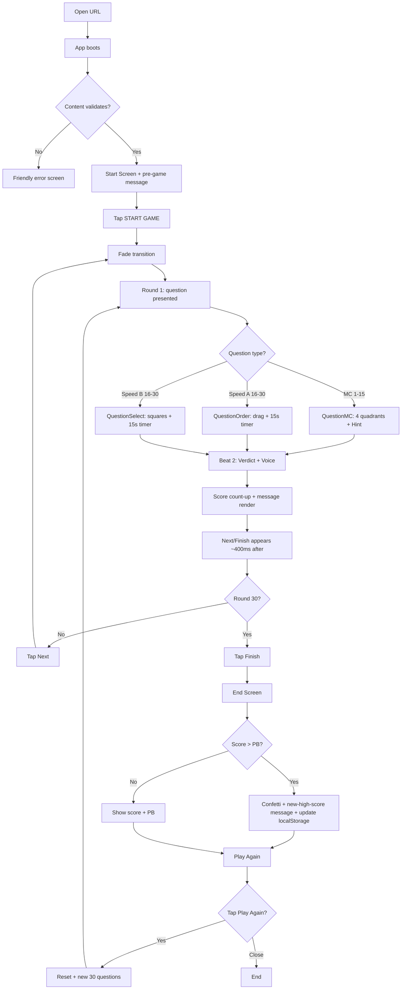
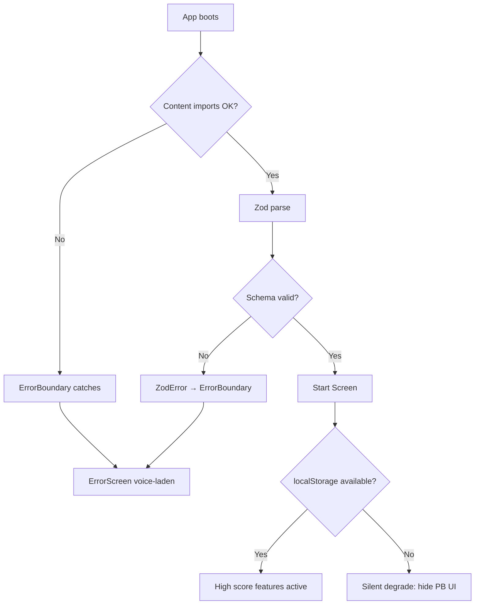

# UX Design Specification skilldares

**Author:** Briphi
**Date:** 2026-05-23

---

<!-- UX design content will be appended sequentially through collaborative workflow steps -->

## Executive Summary

### Project Vision

Skilldares is a 30-round quiz game that makes Kildares menu memorization fun for new servers. It's a static web app with no login, no accounts — just open, play, and the game's distinct irreverent voice tells you whether you're crushing it or blowing it. The product is the quiz; the moat is the voice.

### Target Users

**Primary:** A new server in their first week at Kildares. Mobile-first (uses on their own phone). Session length: 5–8 minutes per game. Plays between or after shifts. No tolerance for tutorials or onboarding screens — the mechanics must be discoverable through play.

**Single-user assumption:** Each server uses the app on their own phone. Shared-device usage is not designed for in v1.

### Key Design Challenges

1. **Drag-and-drop on mobile for Type A (Order) questions** — flagged in PRD §8 as a counter-metric risk. The touch interaction must feel weighted and unambiguous to prevent knowledge-confounding UX failures.
2. **Timer urgency without panic** — the 15-second speed-round timer plus shake-on-low motion must motivate, not stress.
3. **Voice landing as "fun snark" not "actually mean"** — the irreverent + sometimes profane voice has to feel like a friend roasting you, not a bully. Typography, timing, and color treatment determine which side it lands on.
4. **No Start-screen instructions** — the mechanics must be self-explanatory from round 1 (deliberate scope decision). UI affordances carry the entire onboarding burden.
5. **Visual identity tension** — fresh game-energy aesthetic (primary) + Irish-pub palette (bonus). The brand reference (`kildarespubwc.com`) is more restrained than the product voice; a synthesis is required.
6. **Pacing across 30 rounds** — 5–8 minutes is long for a mobile session. Animations and feedback timing compress the perceived gap between rounds.

### Design Opportunities

1. **Voice + visuals as the differentiator** — no other restaurant training tool talks to users like this. Lean into the brash visual personality.
2. **Speed-round visual shift** — rounds 16–30 can feel visually distinct from 1–15, signaling a difficulty/intensity escalation.
3. **Drag interaction as a feature** — weight, snap, satisfying feedback. Done well, Type A becomes the most distinctive moment in the app.
4. **High-score celebration as an emotional peak** — beating the personal best is the most positive moment the product has; deserves a distinctive treatment.
5. **Feedback overlay as stage time for the voice** — each post-answer moment is the personality's moment to shine; visual treatment compounds across 30 rounds.

## Core User Experience

### Defining Experience

The core user action is **answering a question** — a tight loop the player performs 30 times per game. Read prompt → choose / drag / select → submit → see feedback → tap next. If this single loop feels effortless and rewarding, the product works. Everything else is scaffolding.

### Platform Strategy

- **Primary:** Mobile browser (phone-in-pocket usage). Modern Safari + Chrome on mobile (latest 2 versions).
- **Secondary:** Desktop browser. Same UI, scaled up responsively.
- **Input:** Touch primary; pointer + keyboard supported (per PRD FR14).
- **Viewport range:** 320px (small mobile) to 1920px (desktop), per NFR4.
- **Offline / PWA / installable:** Not in v1 scope. The app loads once over HTTPS and runs from in-bundle content.

### Effortless Interactions

- **Tapping an MC answer:** immediate lock, no confirmation
- **Dragging a Type A item:** snappy pickup, visible drop zone, satisfying release with no ambiguity
- **Reading post-answer feedback:** appears instantly, full-screen-readable, no scroll
- **Advancing to next round:** one tap on a clear primary button
- **Restarting after end:** one tap; no confirmation dialog

### Critical Success Moments

- **Round 1 first answer** — player has no instructions; the mechanic must be self-evident
- **First time the voice lands** — the brand moment; player realizes the app has attitude
- **First speed round (round 16)** — visual shift signals difficulty escalation
- **Timer running low** — shake-on-low must motivate, not panic
- **End screen with new personal best** — the rare emotional peak; deserves distinctive treatment

### Experience Principles

1. **The mechanic teaches itself.** No instructions; affordances do the teaching. Round 1 is self-explanatory.
2. **The voice is omnipresent.** Every text moment — button labels, error copy, feedback messages — is the personality talking. Never a sterile string when a personality-laden one would do.
3. **Mobile-first, always.** Touch targets ≥44pt, drag mechanics tuned for thumb-driven interaction, layouts that work in portrait on a 320px phone.
4. **Momentum over thoroughness.** Transitions are tight (<300ms). Feedback is short. Players never feel slowed.
5. **Failure is funny, not punishing.** Wrong answers get roasted by the voice, not buried in shame. Red used sparingly; the dominant feeling after a wrong answer should be "ouch, that was hilarious" not "I'm bad at this."

## Desired Emotional Response

### Primary Emotional Goals

**Amused and motivated.** The player should finish a session smiling, slightly addicted, and a little more confident about the menu than when they started. The voice is the source of amusement; the streak system + personal best are the source of motivation.

### Emotional Journey Mapping

- **Open URL** → curious, slightly intrigued
- **Start screen + pre-game message** → first hit of the personality voice
- **Round 1** → focused, slightly uncertain (no instructions; figuring it out)
- **First correct + praise** → brand epiphany ("this thing has attitude")
- **First wrong + roast** → laugh, not shame
- **Hint moment** → tempted (5pt risk vs 2pt safety)
- **Round 16 first speed round** → anticipation ("here we go"), not dread
- **Timer at low** → focused urgency, hands moving — not panic
- **3+ correct streak** → pride, momentum, feeling smart
- **Streak broken** → dramatic ouch + laugh
- **End screen no PB** → "I can do better — one more"
- **End screen new PB** → genuine delight, bragging-rights pulse
- **Tap Play Again** → "just one more"

### Micro-Emotions

**Wanted:** confidence, trust in the voice, productive flow, excitement at the timer, amusement, accomplishment, anticipation.

**Avoided:** confusion, skepticism, boredom, anxiety, offense, frustration with controls, dread.

### Design Implications

| Emotion target | UX design choice |
| --- | --- |
| Voice lands | Bold typography for feedback messages; large readable size |
| Roast not bully | Red used sparingly; never as punishment shade. Wrong-answer screens stay playful, not scolding |
| Anticipation at timer | Timer visible but not dominating; shake is sharp + brief, not constant tremor |
| Pride at streak | "On fire" moments get distinctive treatment (color pop, scale, sustained energy) |
| Dramatic streak-break | The "you HAD it" moment gets its own visual punctuation — not a generic "wrong" screen |
| Drag delight | Snappy pickup, weighted drop, satisfying snap-to-slot |
| New high score delight | Distinctive end-screen treatment — confetti, scale, sustained celebratory beat |
| One-more impulse | Play Again CTA visually prominent; end-screen voice teases another round |

### Emotional Design Principles

1. **Roast, don't bully.** Wrong answers get a snarky message, never a shaming tone. The voice is a sharp friend, not an angry parent.
2. **Reward the comeback.** Streak transitions (broken and comeback) are the most emotionally charged single moments in the game — they get distinct visual treatment.
3. **Pace = energy.** Tight transitions (<300ms) create momentum. Long pauses kill the feeling.
4. **The voice IS the brand.** Typography, weight, and color of messages signal confident personality, not generic feedback text.
5. **One more game.** Every end screen leaves the player wanting one more attempt. The Play Again button is psychologically prominent.

## UX Pattern Analysis & Inspiration

### Inspiring Products Analysis

- **Duolingo** — voice as brand, rhythmic post-answer feedback, streak-driven daily return. Lesson: voice and rhythm are the engagement engine.
- **Wordle** — static, single-purpose, no friction, strong end-of-game share moment. Lesson: tight loops + ritual shape + zero account friction.
- **Kahoot!** — 4-color answer quadrants, classroom-energy visuals, big and loud. Lesson: answer options as distinct color regions, huge tap targets, bold not subtle.
- **HQ Trivia** — visual timer urgency done well, pulse + dramatic countdown without panic. Lesson: timer urgency is design, not just text.

### Transferable UX Patterns

- **Voice-laden UI copy** (Duolingo) — every button label, every error, every transition string is the personality talking. "Submit" → "Lock it in." "Next" → "Hit me."
- **Big-color-block answer options** (Kahoot) — MC answers as 4 distinct color quadrants with huge tap targets. Tap anywhere in the block = answer.
- **Timer as visual pulse, not text** (HQ) — circular or linear progress depleting; shake + color shift at low. Never a clock-text countdown.
- **Streak indicator with escalation** (Duolingo) — small "🔥3" badge that escalates visually at 5, 7, etc. Streak-broken moment gets distinct treatment.
- **No-loading static feel** (Wordle) — render the first question immediately; never show spinners or skeletons.

### Anti-Patterns to Avoid

1. **Corporate training app sterility** — no blue-gray palettes, no "Next" buttons floating in the bottom-right, no LMS-spreadsheet vibes.
2. **Multi-screen onboarding tutorials** — explicitly excluded; reinforced by ensuring round 1 is self-explanatory.
3. **Cluttered HUD** — maximum chrome: score + question count + (timer on speed rounds). Nothing else.
4. **Confirmation dialogs** — no "Are you sure?" prompts; preserve momentum.
5. **Tiny tap targets** — nothing under 44pt on mobile, especially hint and answers.
6. **Loading spinners / skeletons** — synchronous in-bundle loading; never show a spinner.
7. **Modal popups** — feedback is inline / overlaid, not modal.
8. **Text countdown timer** — visual progression instead of "15... 14... 13..."

### Design Inspiration Strategy

**Adopt:** Duolingo voice rhythm, Kahoot color-block answers, HQ visual timer urgency, Wordle static no-fluff feel.

**Adapt:** Duolingo's streak system with more dramatic broken/comeback treatment unique to Skilldares; Kahoot's color blocks in a more refined palette.

**Avoid:** training-app sterility, onboarding tutorials, cluttered HUDs, confirmation dialogs, tiny tap targets, loading spinners, modal popups, text countdowns.

## Design System Foundation

### Design System Choice

**Custom design system, token-driven via CSS custom properties.** No external UI library; consistent with architecture's plain-CSS + CSS Modules decision. The visual identity is sufficiently distinct (game-energy bold; willing to be brash) that no established system fits.

### Rationale for Selection

- Skilldares' brand IS the differentiator — visual uniqueness matters and any established system would dilute it
- Architecture (Step 4) already rejected UI libraries as overhead-not-justified for ~12 components
- Token-driven CSS variables give a single source of truth for all visual decisions, modifiable by a single file
- AI-friendly: agents can read and tune the token file without learning a third-party theme spec
- Zero runtime cost — just CSS

### Implementation Approach

Design tokens defined as CSS custom properties at `:root` in `src/styles/global.css`. Categories:

| Token group | Purpose |
| --- | --- |
| `--color-bg-*` | Background layers (default, elevated, accent) |
| `--color-text-*` | Text colors (primary, muted, inverse) |
| `--color-state-*` | State communication (success, error, warning, info) used sparingly |
| `--color-brand-*` | Brand colors (primary, secondary, accent) — bold, high-contrast |
| `--color-answer-*` | The four distinct MC answer block colors |
| `--font-display`, `--font-body`, `--font-ui` | Type family roles |
| `--text-{xs..3xl}` | Fluid type scale via `clamp()` |
| `--space-{1..8}` | 4px-based spacing scale |
| `--radius-{sm,md,lg,full}` | Corner rounding |
| `--shadow-{sm,md,lg}` | Elevation, used sparingly |
| `--motion-fast/base/slow` | Animation durations (150/250/400ms) |
| `--ease-snappy`, `--ease-bounce` | Timing functions |

Motion-specific variants (fade, shake, count-up, etc.) live in `src/lib/motionVariants.ts` (per architecture).

### Customization Strategy

- The token file is the single source of brand truth. Change visual identity by editing one file.
- Component CSS Modules MUST reference tokens via `var(--...)`. Hardcoded hex / px inside component CSS is an anti-pattern.
- **Theme direction:** dark-first. A deep neutral background lets bold colors and the personality voice pop. Matches Duolingo's bright-on-rich-color and Kahoot/HQ's high-energy gaming aesthetic. Light mode deferred unless accessibility (out of v1) requires it.
- **Irish-pub bonus integration:** pull accent colors (greens, creams, gold) from `kildarespubwc.com` palette. Use as ACCENTS — success-state green tinted toward Kildares green; new-high-score moment uses Kildares gold. Dominant palette stays high-energy / dark / bold.

## Defining Experience

### Defining Experience

**The voice judges every answer.** Skilldares' defining interaction is the three-beat answer loop: **answer → verdict + personality message → advance**. This happens 30 times per game and is where the product's distinctiveness lives. Other quiz apps tell you whether you were right; Skilldares tells you what to think about yourself for it.

### User Mental Model

Players bring quiz-app expectations (tap answer → red/green feedback → next). Skilldares adds an unexpected voice layer that creates the brand moment. Confusion risks: tap affordances on answer blocks, timer visual semantics, shake-on-low interpretation. Mitigation: clear visual affordances + tight visual coupling between system state and on-screen feedback.

### Success Criteria

1. The voice lands within the first 5 answers (player smiles, smirks, or "oh-no's")
2. Total time from answer-tap to next-question-ready is <3 seconds when player taps Next immediately
3. Players read messages instead of skipping past them
4. Streak transitions (on-fire, streak-broken, comeback) feel visually distinct from baseline correct/wrong
5. The hint mechanic creates real tension (5pt risk vs 2pt safety feels meaningful)

### Novel UX Patterns

**Established (no education needed):** MC with 4 options, drag-to-order, multi-select with submit, timer-based speed round, hint button.

**Novel:** Voice + streak-aware messaging layer (8 pools, 370 messages). No other quiz app personalizes feedback to player state with this texture. The pattern teaches itself by being undeniable; no explicit onboarding required.

### Experience Mechanics — The Three-Beat Loop

**Beat 1: Answer (instantaneous)**
- MC: tap block → locks visually with subtle scale/settle. No confirm.
- Speed A: drag to order → tap Submit.
- Speed B: tap to select/deselect → tap Submit.
- Timer expiry on speed rounds: auto-submits as wrong.

**Beat 2: Verdict + Voice (≈ 2–3s, player-paced)**
- ✓ / ✗ visual, bold but not screaming
- Background color shift (subtle green or red tint pulse — never full wash)
- MC: correct answer highlighted; player's wrong pick muted
- Speed A: factor values revealed beneath each square
- Speed B: ✓/✗ overlays on selected squares; correct unselected also subtly revealed
- Score count-up animation triggers if points awarded
- Personality message renders in bold typography, center, sized for impact
- Next/Finish button appears ≈400ms after verdict (read time without dead time)

**Beat 3: Advance (≈ 300ms)**
- Tap Next → fade out current view → fade in next question
- Score persists in upper-right
- Streak indicator updates if applicable

### Loop Variants by Player State

| Player state | Visual treatment | Message pool |
| --- | --- | --- |
| Correct, no streak | Subtle green tint | `right-no-streak` |
| Wrong, no streak | Subtle red tint | `wrong-no-streak` |
| Correct, 3+ streak | Brand-accent color shift, streak indicator pulses | `on-fire` |
| Wrong, breaking 3+ correct streak | Dramatic red, streak indicator shatters/fades | `streak-broken` |
| Correct, ending 3+ wrong streak | Celebratory color shift | `comeback` |
| End screen, new personal best | Confetti / particles, sustained beat | `new-high-score` |

## Visual Design Foundation

### Color System

**Theme:** dark-first. Bold colors on a deep neutral background.

**Brand palette** (proposed; tune during implementation):

| Token | Use | Suggested value |
| --- | --- | --- |
| `--color-bg-default` | Page background | `#0e1117` |
| `--color-bg-elevated` | Cards, question containers | `#181c22` |
| `--color-bg-accent` | Highlighted regions | `#212732` |
| `--color-text-primary` | Body + display text | `#f4ead5` (Kildares cream) |
| `--color-text-muted` | Secondary text | `#a8b3a0` |
| `--color-text-inverse` | Text on bright surfaces | `#0e1117` |
| `--color-brand-primary` | Primary CTAs, key accents | `#f4b400` (Kildares-leaning warm gold) |
| `--color-brand-secondary` | Secondary accents | `#2d6a4f` (Kildares deep green, energetic) |
| `--color-brand-accent` | Special moments (high score) | `#ff6b35` (celebratory coral) |

**Answer block palette** (4 distinct quadrants, Kahoot-inspired but more designerly):

| Token | Value |
| --- | --- |
| `--color-answer-1` | `#3b82f6` (blue) |
| `--color-answer-2` | `#ec4899` (pink) |
| `--color-answer-3` | `#f59e0b` (amber) |
| `--color-answer-4` | `#10b981` (emerald) |

**State colors** (used sparingly):

| Token | Use | Value |
| --- | --- | --- |
| `--color-state-success` | Correct overlays | `#22c55e` |
| `--color-state-error` | Wrong overlays | `#dc2626` (muted, not punishing) |
| `--color-state-warning` | Timer low | `#f97316` |
| `--color-state-info` | Neutral system | `#06b6d4` |

### Typography System

**Pairing:**
- **Display:** Bricolage Grotesque (variable, modern, personality at large sizes)
- **Body / UI:** Inter (universally readable, complements Bricolage)
- **Fallback stack:** `system-ui, -apple-system, sans-serif`

Both available free via Google Fonts. Display handles feedback messages + screen titles (the voice's stage time); body handles question text + UI labels.

**Fluid type scale (via `clamp()`):**

| Token | Range (mobile → desktop) | Use |
| --- | --- | --- |
| `--text-xs` | 12 → 14px | Metadata, hint text |
| `--text-sm` | 14 → 16px | Secondary labels |
| `--text-md` | 16 → 18px | Default UI, answer options |
| `--text-lg` | 20 → 24px | Question prompts |
| `--text-xl` | 24 → 32px | Subtitles |
| `--text-2xl` | 32 → 48px | Screen titles, scores |
| `--text-3xl` | 40 → 64px | Feedback messages — the voice's stage |

**Weights:** body 400, medium 500, bold 700, black 900 (display-only).

### Spacing & Layout Foundation

**Spacing scale (4px base):** 4, 8, 12, 16, 24, 32, 48, 64 (`--space-1` through `--space-8`).

**Radii:** 4 / 8 / 16 / 9999 (`--radius-sm/md/lg/full`).

**Layout principles:**
- Single-column on mobile; centered with max-width ~640px on desktop
- No grid system; every screen has a clear primary content area
- Generous breathing room (≥`--space-5` between major elements)
- Touch targets ≥44pt × 44pt

### Motion

Motion durations + easings as design tokens (variants module lives in code per architecture):

| Token | Value | Use |
| --- | --- | --- |
| `--motion-fast` | 150ms | Tap response |
| `--motion-base` | 250ms | Standard transitions |
| `--motion-slow` | 400ms | Screen transitions, celebrations |
| `--ease-snappy` | `cubic-bezier(0.4, 0, 0.2, 1)` | Default ease |
| `--ease-bounce` | `cubic-bezier(0.34, 1.56, 0.64, 1)` | Score count-up, button presses |

### Accessibility Considerations

Formal accessibility (WCAG, screen-reader, keyboard nav) is out of v1 per PRD. Basic usability defaults that matter for everyone:

- **Text contrast:** target WCAG AA (4.5:1); proposed cream-on-charcoal easily clears
- **Touch targets:** ≥44pt × 44pt
- **No reliance on color alone:** correct/wrong feedback uses ✓/✗ icons alongside color tint (works for color-blindness)
- **Reduced-motion preference:** respect `prefers-reduced-motion` for shake-on-timer specifically; other animations subtle enough to leave on

## Design Direction Decision

### Design Directions Explored

Three textual directions evaluated (HTML mockup file deferred):

1. **Direction A — Bold Quadrants** (Kahoot-energy). MC fills screen as 4 distinct colored answer blocks. Maximum tap targets, maximum visual identity.
2. **Direction B — Card Stack** (Apple-fitness refined). 4 stacked cards with subtle color accents. Polished but loses brand bold.
3. **Direction C — Conversational** (chat-style). Voice-forward; questions arrive as chat bubbles. Novel but adds friction.

### Chosen Direction: A — Bold Quadrants

**Why:**
- Aligns with Step 5's Kahoot inspiration and Step 7's "voice as additive layer, mechanic as familiar foundation"
- Biggest tap targets, lowest tap-error rate (critical for mobile)
- Most distinctive visual identity — looks like a *game*, not a training app
- Scales cleanly across all three question types and across all screens
- Voice still gets dominant stage time during Beat 2 (feedback overlay)

### Design Rationale

Direction A keeps the answer-tap action tight and unambiguous (Beat 1 of the loop) while leaving the feedback overlay (Beat 2) free to be voice-forward and visually dominant. This maximizes both the mechanical clarity AND the voice impact — the two things that have to land.

The Kahoot reference is real but the execution is more designerly: refined hex values for the 4 answer colors, generous spacing, premium typography (Bricolage Grotesque + Inter), not Kahoot's saturated-primary classroom feel.

### Implementation Approach (Direction A across screens)

- **Start screen:** centered title + random pre-game message + big primary START GAME button
- **MC questions:** thin header (score + question count) + question prompt + 4 colored quadrants + hint button bottom-center
- **Speed Type A (Order):** header with timer progress bar + prompt + draggable rows with handles + Lock-It-In submit
- **Speed Type B (Multi-Select):** header + prompt + grid of squares with tap-to-select indicators + Lock-It-In submit
- **Feedback overlay:** big ✓/✗ + bold personality message (display font, 3xl) + points awarded + Next/Finish button (revealed 400ms after verdict)
- **End screen:** final score + personal best + Play Again button. If new high score: confetti + display-font celebration + new-high-score pool message.

All screens use design tokens from Step 8 (dark-first palette, fluid type scale, 4px spacing). Motion via the central `motionVariants.ts` per architecture.

## User Journey Flows

### UJ-1 — First Play (Canonical Flow)



### UJ-2 — Replay

Structurally identical to UJ-1 from the reset point. Player mental model differs (knows mechanics, has a PB to beat). No separate Start-screen treatment in v1; the End-screen PB comparison carries the "beat it" motivation.

### Error Recovery Flow



### The Three-Beat Answer Loop (Reusable Pattern)

Used 30× per game. **Beat 1** Answer (instant) → **Beat 2** Verdict + Voice (~2-3s player-paced) → **Beat 3** Advance (~300ms fade). Lock-on-tap, no confirm, no back nav.

### Reusable Journey Patterns

- **Navigation:** Linear, no back, no skip. Refresh = restart. Single primary CTA per screen.
- **Decisions:** Hint button is the only mid-round decision (MC only). No confirmation dialogs.
- **Feedback:** Beat 2 always renders; streak transitions visually amplified; score always animated count-up; errors use personality voice.

### Flow Optimization Principles

1. **Minimize steps to value** — 2 interactions from URL-open to first question.
2. **Reduce cognitive load** — one primary action per screen.
3. **Clear progress signal** — question count ("Q 5/30") in header; no progress bar.
4. **Moments of delight** — first-voice-landing, on-fire streak, new-high-score.
5. **Graceful failure** — localStorage missing = silent degrade; JSON broken = friendly voice error screen.

## Component Strategy

### Design System Components

None — chose a custom design system (Step 6). All components are custom.

### Component Inventory

13 components total across 3 groups:

- **Screens (3):** StartScreen, GameScreen, EndScreen
- **Game round-level (7):** QuestionMC, QuestionOrder, QuestionSelect, ScoreDisplay, TimerDisplay, HintButton, FeedbackOverlay
- **Shared primitives (3):** Button, ItemSquare, ErrorScreen

### Custom Component Specifications

For each component: purpose, anatomy, states, accessibility notes are reflected in the architecture's file tree at `_bmad-output/planning-artifacts/architecture.md`.

**Distinctive specs worth highlighting:**

- **QuestionMC:** 2×2 grid of color-block answers; states include `default`, `locked`, `correct-reveal`, `greyed-out` (post-hint), `muted`
- **QuestionOrder:** dnd-kit SortableContext with all sensors enabled; submitted state reveals factor values beneath each row
- **QuestionSelect:** Selection state per square with 6 reveal states (selected-correct, selected-wrong, unselected-correct, unselected-wrong, plus pre-reveal selected/unselected)
- **ScoreDisplay:** Count-up animation via `--motion-base` + `--ease-bounce`
- **TimerDisplay:** Visual bar or circle (not text); shifts to `--color-state-warning` + shake variant when ≤5s; respects `prefers-reduced-motion`
- **FeedbackOverlay:** 5 visual states matching message pool variants (correct, wrong, streak-broken, on-fire, comeback)
- **EndScreen:** 2 variants — standard vs celebrating (new PB triggers confetti + sustained beat)

### Implementation Strategy

- All components consume design tokens via `var(--...)` (no hardcoded colors / sizes)
- All animations use Motion variants from `src/lib/motionVariants.ts`
- Components live in the file tree specified in architecture.md
- Accessibility built in at the component level (semantic `<button>`s, ARIA labels, focus management, `prefers-reduced-motion`)

### Implementation Roadmap

**Phase 1 — Core flow:** Button → GameScreen → QuestionMC → ScoreDisplay → HintButton → FeedbackOverlay → StartScreen → EndScreen
**Phase 2 — Speed rounds:** ItemSquare → TimerDisplay → QuestionOrder → QuestionSelect
**Phase 3 — Polish & safety:** ErrorScreen → PB-celebration variant of EndScreen

Phase 1 delivers a playable game (MC-only). Phase 2 adds speed rounds. Phase 3 hardens edges.

## UX Consistency Patterns

### Pattern Scope

Most generic pattern categories (forms, navigation, modals, loading states, search) don't apply to Skilldares' linear, content-driven flow. The patterns that matter for consistency:

- Button hierarchy
- Copy / voice patterns
- Tap interaction patterns
- Feedback patterns
- Animation patterns
- Error patterns
- Touch target patterns

### Button Hierarchy

- **Primary CTA** (`variant="primary"`): START GAME, Lock It In, Next, Finish, Play Again. Bold gold (`--color-brand-primary`), ≥56pt tall, prominent placement.
- **Secondary action** (`variant="secondary"`): Hint button only. Smaller pill, ≥44pt tall, muted treatment.
- No tertiary, no icon-only.

### Copy / Voice Patterns

Every UI string reflects the personality voice. Lives in `src/content/uiStrings.ts`. Examples:

| Corporate equivalent | Skilldares |
| --- | --- |
| Submit | LOCK IT IN |
| Next | NEXT → |
| Finish | FINISH IT |
| Play Again | RUN IT BACK |
| Error | "Something broke. Try refreshing." |

### Tap Interaction Patterns

**Lock-on-tap rule:** taps lock immediately. No confirm dialogs, no second-tap-to-confirm. MC tap = lock + Beat 2. Speed submit = lock + Beat 2. Hint = single-use per question.

**Tap-to-deselect on Speed Type B:** tapping a selected square deselects (toggle behavior).

### Feedback Patterns

Single pattern: the Beat 2 verdict overlay. Used after every answer + every timer expiry. State variants drive color, message pool, motion (see Defining Experience section).

No toasts, banners, inline form errors. The Beat 2 overlay IS the feedback system.

### Animation Patterns

Three reused patterns, all defined in `src/lib/motionVariants.ts`:

- **Screen fade transitions** via `<AnimatePresence>` with `--motion-base` + `--ease-snappy`
- **Score count-up** with `--motion-base` + `--ease-bounce`
- **Timer shake on low** at ≤5s, respects `prefers-reduced-motion`

### Error Patterns

Single pattern: `ErrorScreen` rendered by top-level ErrorBoundary. Voice-laden copy, no retry button, no error code. Only "fix" is refresh.

### Touch Target Patterns

- Minimum: 44×44pt
- Primary CTAs: ≥56pt tall, full-width with side padding
- MC quadrants: ≥120pt tall, full quadrant tappable
- Hint: ≥44pt tall, ~140pt wide
- Speed Type B squares: ≥80×80pt
- Speed Type A rows: entire row is draggable surface

## Responsive Design & Accessibility

### Responsive Strategy

Mobile-first per NFR4. Single-column layout that scales up; no rearrangement across breakpoints.

| Viewport range | Treatment |
| --- | --- |
| 320–767px (mobile) | Single column, full-width. Touch targets ≥44pt. Bottom-anchored CTAs. |
| 768–1023px (tablet) | Same layout, max-width capped at ~640px and centered. |
| 1024px+ (desktop) | Same layout at 640px max-width, centered with generous margins. |

The app deliberately does not pivot layout across breakpoints — it scales with more breathing room. Simplicity over responsive sophistication for a single-purpose game.

### Breakpoint Strategy

Three breakpoints, used sparingly. Most styling is fluid via `clamp()` from Step 8 tokens.

```css
:root {
  --bp-mobile: 320px;
  --bp-tablet: 768px;
  --bp-desktop: 1024px;
}
```

### Accessibility Strategy

**Formal WCAG compliance is out of v1 scope** per PRD. Basic usability defaults that are cheap to implement:

| Concern | Approach |
| --- | --- |
| Text contrast | WCAG AA (4.5:1) via cream-on-charcoal palette |
| Touch targets | ≥44×44pt minimum |
| Color-not-alone | ✓/✗ icons accompany color on every verdict |
| `prefers-reduced-motion` | Honored for timer shake; other animations stay on |
| Semantic HTML | `<button>` not `<div>` for interactive elements |
| Focus visibility | Don't suppress browser `:focus-visible` rings |
| Keyboard nav | Not formally implemented v1; `<button>` defaults provide basic support |
| Screen reader | Not formally tested v1; basic ARIA on TimerDisplay + FeedbackOverlay + ErrorScreen |

Full WCAG compliance deferred to post-v1.

### Testing Strategy

**Responsive:** Manual testing on real iPhone Safari + Android Chrome at common sizes; laptop + monitor. DevTools spot-checks at 320/768/1024/1440/1920. Drag-and-drop verified on real phone (counter-metric from PRD §8).

**Accessibility (light-touch):** Lighthouse audit for decent score; tab-through keyboard sanity check; brief VoiceOver sanity check on one screen; color-blindness simulation. No formal user testing with assistive tech users in v1.

### Implementation Guidelines

**Responsive:**
- `rem` and `clamp()` over fixed `px` for scaling sizes
- Drag-and-drop exercised on real phone before shipping
- All animations use `--motion-*` tokens; respect `prefers-reduced-motion`

**Accessibility:**
- Semantic HTML (`<button>`, `<main>`, headings)
- `aria-label` on icon-only elements (HintButton 💡)
- TimerDisplay: `aria-live="polite"` region for seconds remaining
- FeedbackOverlay, ErrorScreen: `role="alert"`
- Don't suppress `:focus-visible`
- `prefers-reduced-motion` honored on shake animation
